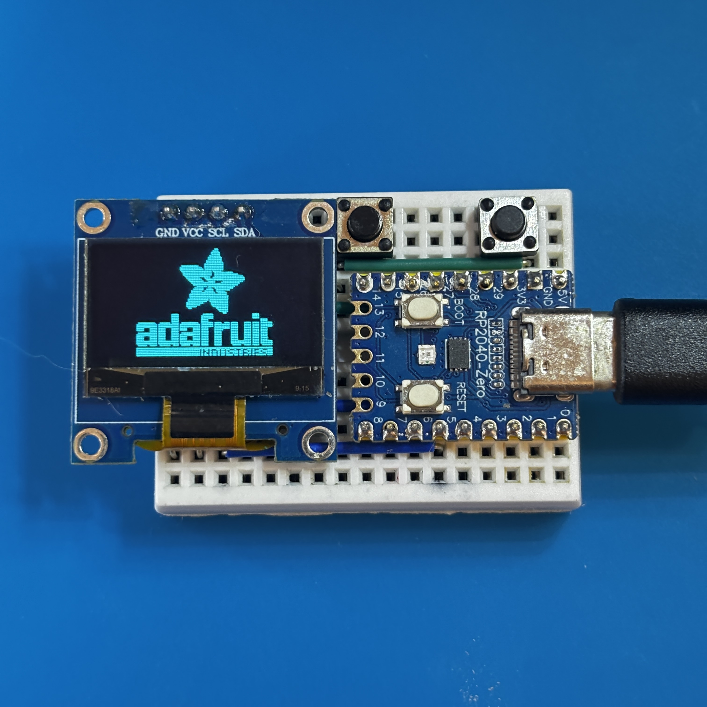
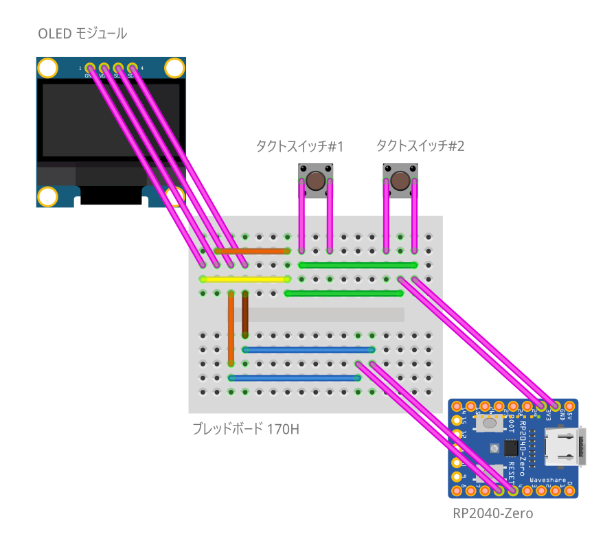
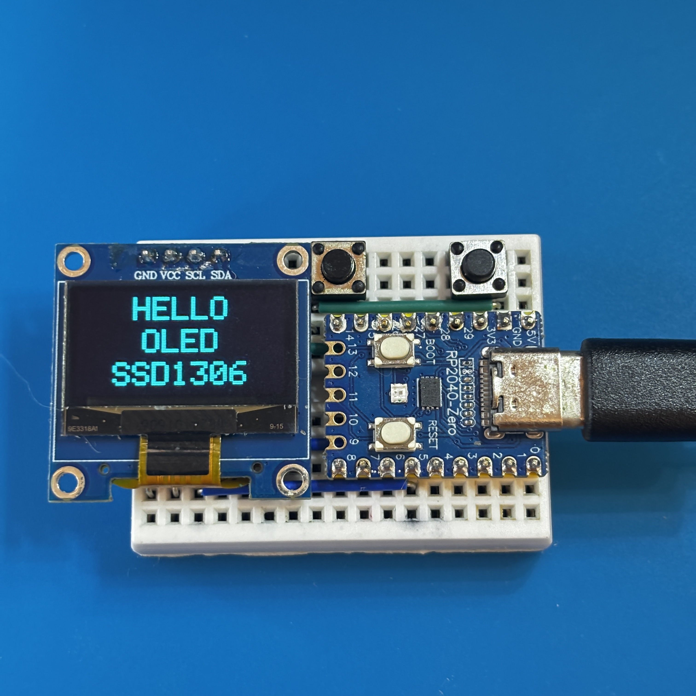
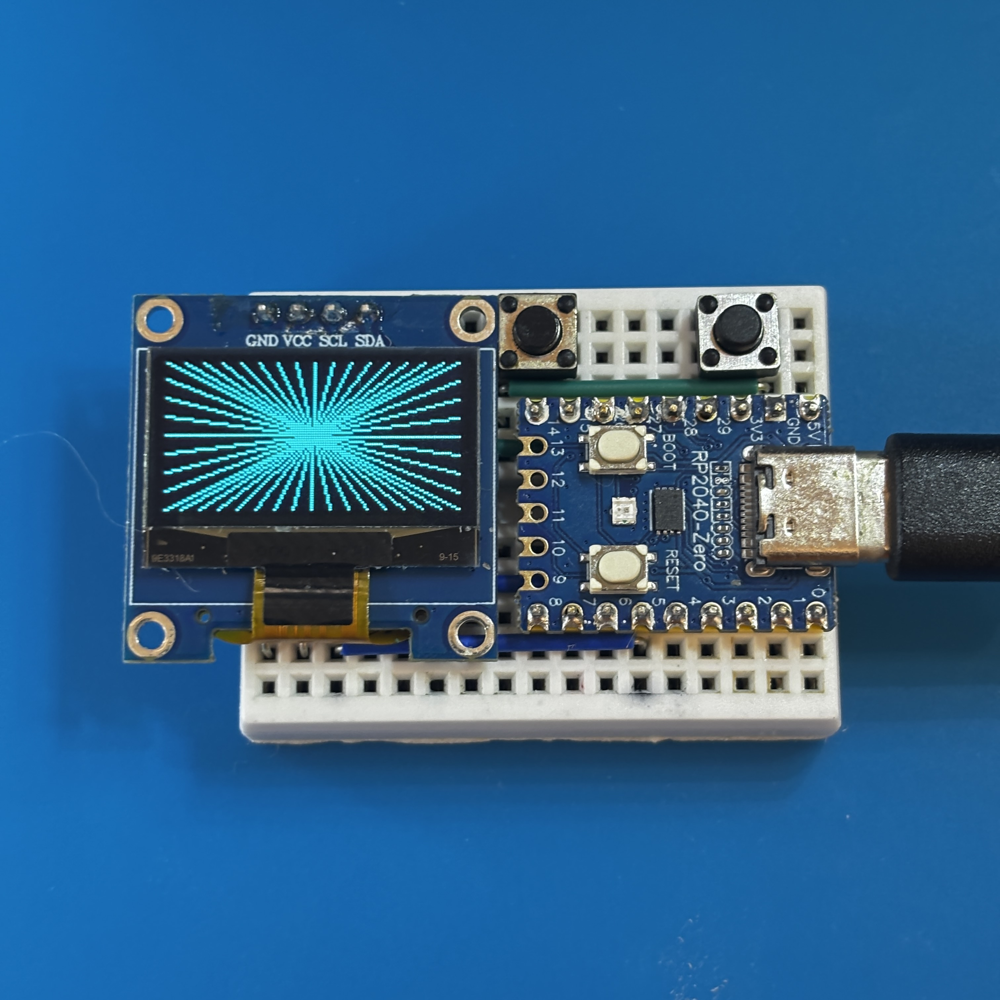

# Arduino: RP2040-OLED-Keys

RP2040-Zero を使用した OLED-Keys テスト回路です。

 

## 部材

- RP2040-Zero 1個
- OLED モジュール 0.96" 128x64 SSD1306 1個
- タクトスイッチ 2P 6x6mm 2個
- ミニブレッドボード 1個
- ジャンパーワイヤ 8本

## 接続

### OLED ディスプレイ

| OLED モジュール | RP2040-Zero |
|---|---|
| VCC | 3.3V |
| GND | GND |
| SDA | GPIO 4 (SDA) |
| SCL | GPIO 5 (SCL) |

### タクトスイッチ

| スイッチ | RP2040-Zero | GND接続 |
|---------|------------------|---------|
| 右ボタン | GPIO 15 | GND |
| 左ボタン | GPIO 29 | GND |

**タクトスイッチの接続方法:**

- タクトスイッチの片側の端子をマイコンの GPIO ピンに、もう一方をマイコンの GND ピンに接続
- マイコン内蔵プルアップ抵抗を使用するため、別途プルアップ抵抗を接続する必要はありません

### 配線図

## 開発環境

- IDE: Arduino IDE
- ライブラリ:
  - Adafruit GFX Library
  - Adafruit SSD1306

## 操作

右ボタンを押すと順方向に、左ボタンを押すと逆方向に表示パターンが切り替わります。

- 表示ライブラリ開発元のロゴ 
- 文字列表示 
- グラフィック表示 

## ライセンス

このプロジェクトは [MIT ライセンス](./LICENSE) の下で公開されています。
自由に使用、改変、再配布していただけます。
